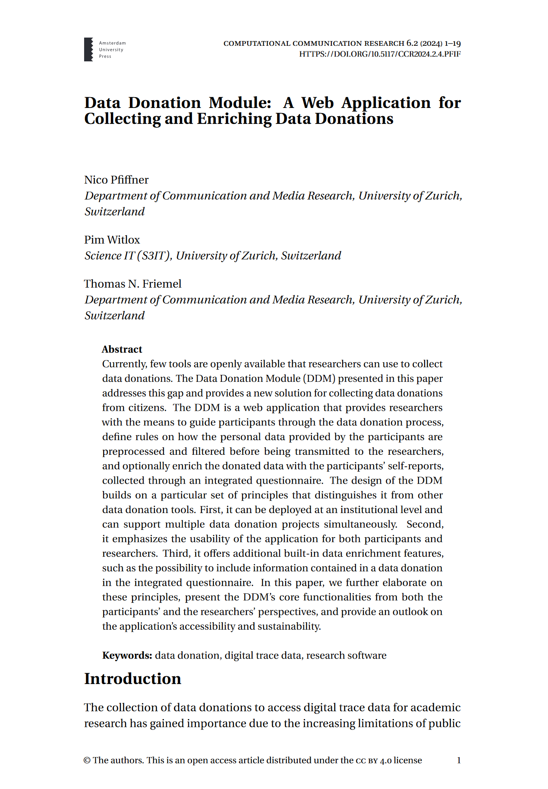

# DDM Documentation

**DDM** (Data Donation Module) is an open-source web-application that researchers can
use to set up data donation projects and collect data donations for academic research.

It is developed and maintained by the [Data Donation Lab](https://datadonation.uzh.ch)
at the University of Zurich.

## Key Features

-   :material-clock-fast:{ .lg .middle } __Easy data donation configuration__

    ---

    Researchers can **configure** the data donation collection (incl. validation 
    and extraction), **access collected data**, and **monitor** on-going data collections 
    through a **graphical user interface**.

    Project configurations can also easily be shared through the integrated 
    export-import functionality.

-   :material-dots-circle:{ .lg .middle } __Supports many platforms__

    ---

    Collect data donations from all platforms that provide a 
    text-based data export, including:
    
    - YouTube :material-youtube:
    - TikTok :simple-tiktok: 
    - Instagram :material-instagram:
    - ChatGPT :fontawesome-brands-openai:

-   :material-checkbox-marked-circle-outline:{ .lg .middle } __Integrated survey tool__

    ---

    DDM includes a built-in, modern survey tool supporting the most used survey
    functionality. 

    Furthermore, DDM can also easily be connected to your survey projects hosted 
    on other platforms (Qualtrics, Unipark, SoSci Survey, etc.).

-   :material-lock-alert:{ .lg .middle } __Privacy by design__

    ---

    DDM puts participant privacy first

    **Local Processing:** Data is extracted in the participant's browser and 
    only submitted after explicit consent

    **Encryption:** All donated data is encrypted before storage

    **Enhanced Encryption:** Activate enhanced encryption for an additional 
    layer of security (e.g., if you're dealing with health data)

## Overview of a data donation collection using DDM

A data donation collection using DDM consists - from a participant's perspective -
of the following steps:

**1) Briefing page**

First, the participant is presented with a briefing page. On this page, researchers
describe their project, and provide a study briefing.

**2) Data donation**

Next, the participant is presented with a webpage through which they can donate their
data. This page is divided into three steps: `(A)` instructions, 
`(B)` data upload, and `(C)` data review and consent.

The participation flow in this step looks as follows:

1. The participant reads the instructions and downloads the relevant file onto their device.
2. The participant uploads their data into DDM.
3. The uploaded data is filtered and transformed according to the rules defined by the researcher 
(e.g., only certain fields are extracted). This happens locally on the participant's device.
4. The participant is presented with the extracted data which they will be donating to the researchers.
5. The participant reviews the extracted data and decides whether to donate their data (i.e., submit their data to the researcher's server).

Steps `2` to `4` are all client-based and executed in the participant's browser. No personal
data is submitted until step `5`.

**3) Follow-up questionnaire (optional)**
After the data donation, the participant fills out the survey the researcher 
has configured in DDM. Questions defined in this questionnaire can be configured 
to include data points from the donated data – either to enrich the donated data 
or to provide participants with insights into their personal data.

This step is skipped if no questionnaire is defined in DDM.

**4) End / debriefing page**
Lastly, the participant sees the debriefing page. From here, researchers can 
optionally redirect participants to another website or web application (e.g., an 
external survey tool).

## Design philosophy

The application is intended to be hosted at an institutional level (e.g., a university, a
university division, or a research conglomerate) and be used by multiple research projects
as it provides the possibility to host multiple independent data donation projects 
simultaneously. Nevertheless, it is also possible to use it for single projects.

For researchers, DDM is designed to be as easy to use as possible. Everything can
be configured through a graphical user interface without requiring in-depth programming knowledge.

!!! abstract "Read more about DDM"

    Read more about DDM and its design philosophies in the accompanying article "Data Donation
    Module: A Web Application for Collecting and Enriching Data Donations" by N. Pfiffner,
    P. Witlox, and T. Friemel (2024), published in *Computational Communication Research*
    ([doi:10.5117/CCR2024.2.4.PFIF](https://doi.org/10.5117/CCR2024.2.4.PFIF)).

    [{ width="220" }](https://doi.org/10.5117/CCR2024.2.4.PFIF)

## Documentation structure

This documentation consists of three parts, each targeted at one specific user group:

- **[Documentation for Researchers](researchers/index.md)**: for researchers who use DDM to set
  up their data donation projects on an existing application server. It demonstrates how to
  create and configure a new data donation project.
- **[Documentation for Administrators](administrators/index.md)**: for server administrators/ dev ops who
  want to set up a server to host DDM.
- **[Documentation for Developers](developers/index.md)**: for developers who want to contribute
  to the development of DDM, or who want to fork and extend DDM on their own.
