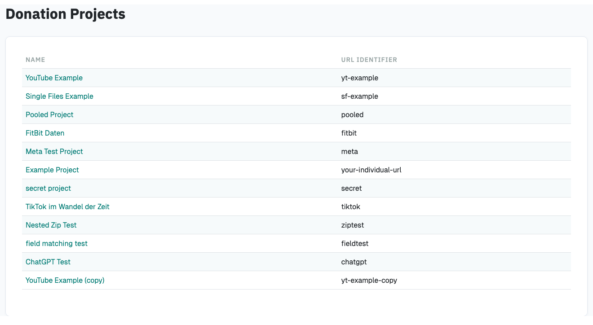
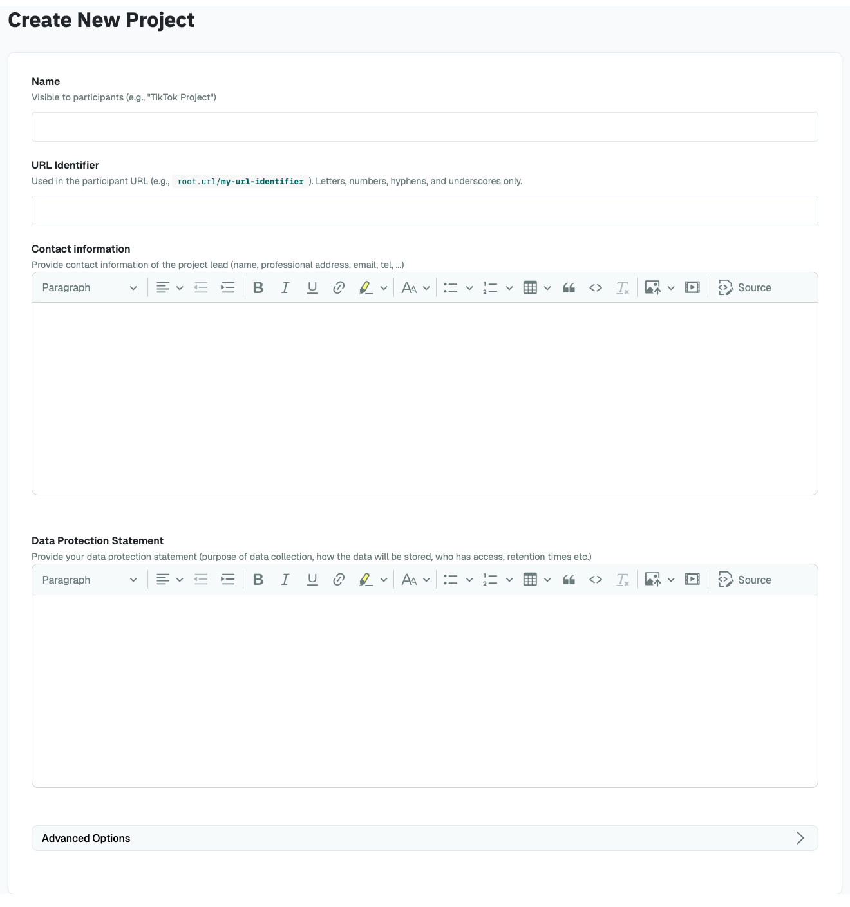

# Creating a Data Donation Project

## Project List

When you access DDM, you will see a list of all your Donation Projects:

{ width="90%" }

To create a new data donation project, click on `Create New Project`.

## Set up a New Project

When creating a new project, you will see this page:

{ width="90%" }

On this page, you define the following settings (you can
also modify most of the settings once the project has been created):

#### `Project Name`
: Name of the project. Visible to participants in the browser's title bar or a page's tab.

#### `URL Identifier`
: Identifier that is included in the URL through which participants can access the project
(e.g, https://root.url/**my-url-identifier**). Can only contain letters, hyphens, numbers or underscores.

#### `Contact Information`
: Contact information of the researcher responsible for the project.
Is linked in the footer of the donation interface and can be viewed by data donors at any stage of the data donation process.

#### `Data Protection Statement`
: Data protection statement that describes how the data is processed.
Is linked in the footer of the donation interface and can be viewed by data donors at any stage of the data donation process.

### Advanced Options

#### `Enable enhanced encryption`
: When creating a project with enhanced encryption, you will have to provide
a project password, which will be used to encrypt all collected data donations and survey responses
(for more information on how collected data is encrypted, see [here](../developers/topics/encryption.md)).
This password will not be saved by the application, and the data collected for
this project can only be encrypted by entering the password that was provided when the project was created.

!!! note

    Some words of caution:

    - After a project has been created, it enhanced encryption cannot be enabled/disabled.
    - There is no way to recover or reset the password used to initialize the project should you loose it.
    - Enabling enhanced encryption will limit the functionality: it won’t be possible to reference data points from
    a data donation in a question.

Once you click on `Create Project` you will be redirected to the
Project Hub of your newly created project.
