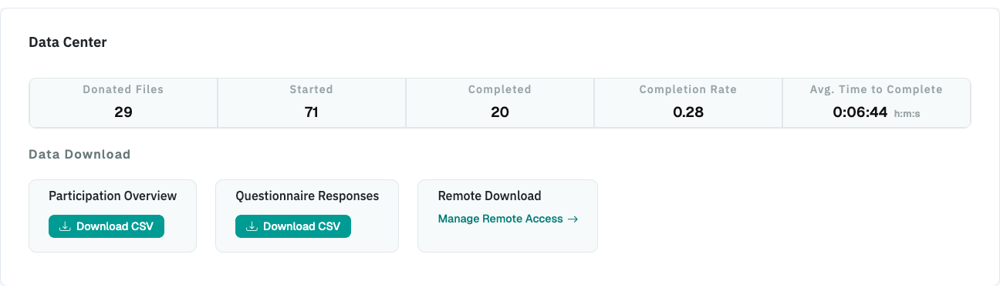

# Data Center

In the Data Center, you can find options to (_a_) [access the collected data](data_download.md),
(_b_) [access the project logs](project_logs.md), and
(_c_) find some [general field statistics](participation_statistics.md) about
the progress of your project.

{ width="95%" }
