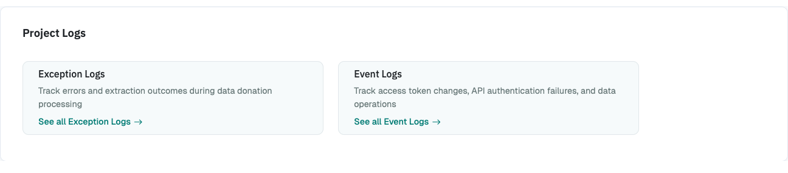

# Project Log: Monitoring an ongoing Project

{ width="95%" }

The Project Log helps researchers to monitor their ongoing data collection
and to identify potential problems occurring during the data donation.

Two types of logs exist for each project: An _Exception Log_ and an _Event Log_.

## Exception Log

The Exception Log lists all exceptions that participants encountered
during the study. The log provides the following information:

- The date and time when the exception occurred
- The type of the exception (for a description of the type-codes, [see here](../topics/project_logs.md))
- Which participant encountered the exception (if applicable)
- For which file blueprint the exception occurred (if applicable)
- If the exception was raised on the client-side (i.e., the participant's browser) or the server side
- A message describing the exception

## Event Log

The Event Log currently registers the following events:

1. When an access token is created or deleted
2. When the API endpoint for the project was called but authentication failed or permission was denied
3. When a data download attempt was successful, failed or denied.
4. When a data delete attempt was successful, failed, or denied.
5. When a participant delete request was successful, failed, or denied.
6. When a client-side log arrived that could not be attributed to a participant
   (the participant's session was missing at the time the log was recorded).
