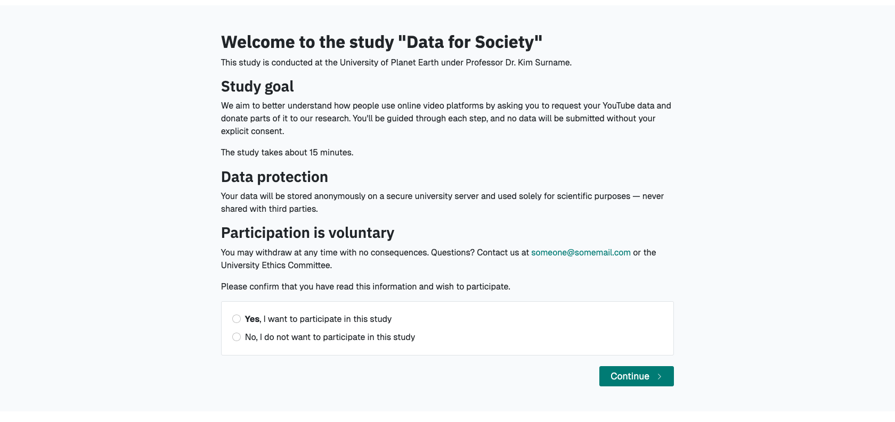

# Briefing Page

The briefing page is the first part of your project and is used to onboard
participants and brief them about your project and the steps ahead.
Additionally, you can obtain explicit consent for the general study participation
by requiring participants to confirm that they have read and agree with the provided
information.

## Participants' Perspective

To the participants, the briefing page will look something like this:

{ width="95%" }

## Configuration Options

You can access the configuration options for the briefing page in 
_Project Hub > Data Collection Configuration > Briefing_.
To configure the briefing page, you have the following options.

#### `Briefing Text`
: Text displayed to participants on the briefing page.

!!! tip

    In the briefing text, you can make use of dynamic template functionalities.
    You can read more about how to use dynamic templates
    [here](../topics/templating_features.md).

#### `Briefing Consent Mandatory`
: If briefing consent is enabled, participants will
have to explicitly indicate their consent at the bottom of the briefing page before
they can continue. If a participant does indicate that they to do not consent,
they will be redirected to the debriefing page.

#### `Briefing consent label yes`
: The label displayed to participants to indicate consent.

#### `Briefing consent label no`
: The label displayed to participants to reject consent.
