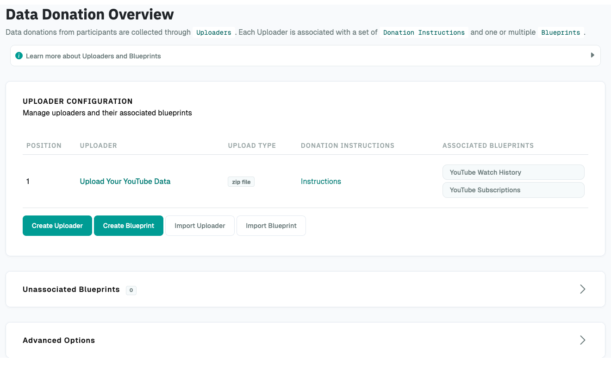
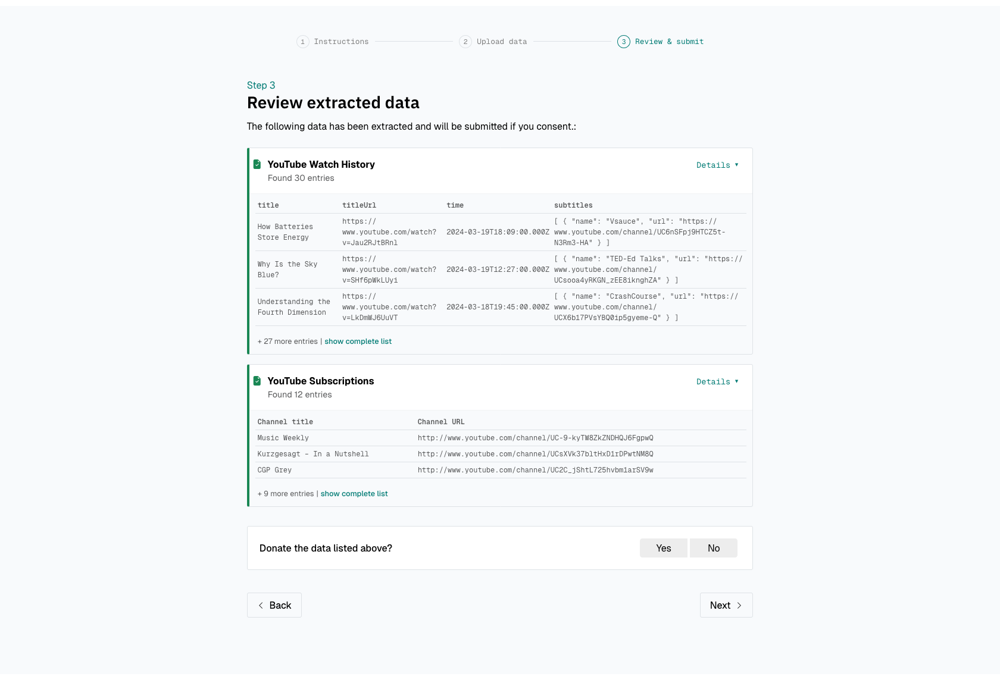

# Data Donation Configuration

The data donation can be configured using so-called `Uploaders`, `Instructions`, and `Blueprints`.

An `Uploader` represents an upload form through which one file can be uploaded (either a ZIP container
or a single file).

For each Uploader, a set of `Instructions` for participants can be created that 
illustrate how they can access and upload the requested file.

A `Blueprint` is used to define what data will be extracted from the file
that participants upload through the Uploader. Each Uploader has one or multiple 
associated Blueprints.

To configure the data donation step, go to the [Project Hub](../../project_hub.md) and click on
_Data Donation_ in the Data Collection Configuration section which will bring you
to the following page:

{ width="95%" }

## Uploader Configuration

When creating an Uploader, you have the following configuration options:

| Setting                    | What it's for                                                                     |
|----------------------------|-----------------------------------------------------------------------------------|
| `Upload Type`              | Whether to accept `single file` or `zip file` upload.                             |
| `Name`                     | Internal name of the uploader.                                                    |
| `Extract nested zip files` | Whether to extract zip files found inside the uploaded zip.                       |
| `Extraction depth`         | How deep to extract nested zip files.                                             |
| `Display name`             | A short description of the Uploader, displayed to participants (e.g., "YouTube"). |
| `Display position`         | Defines the display order if multiple uploaders are configured.                   |
| `All-in-one consent`       | Whether to option consent per Blueprint or for all extracted data at once.        |

??? setting-details "Setting Details"

    ---

    #### `Upload Type`

    Either "single file" or "zip file" depending on whether your participants are expected to upload
    a single file (e.g., CSV or JSON File) or a ZIP-container.

    ---

    #### `Name`

    Internal name of the Uploader. Must be unique per project.

    ---

    #### `Extract nested zip files`

    Whether to extract zip files found inside the uploaded zip and make their contents available
    to be handled by donation blueprints.

    ---

    #### `Extraction depth`

    Maximum levels of nested zip files to extract (0 = only extract the top-level zip).
    
    !!! note
    
        If `Extract nested zip file` is selected, the File Uploader will look inside any zip files
        contained within the main file that participants upload and make those contents available
        for extraction through a Donation Blueprint too.
    
        You can control how many levels deep this works—for example, a depth of 1 means it will open any zip inside the main zip, but stop there.
    
        The paths of the extracted files will reflect the archive structure. For a file inside the main zip,
        the path is simply the filename (e.g., data.json).
        For a file inside a nested zip, the path includes the nested zip's name (e.g., nested.zip/inner.json).

    ---

    #### `Display name`

    Name displayed to participants in the header of the Uploader on the
    data donation page.

    ---

    #### `Display position`

    The position of the Uploader on the data donation page. Uploaders with a
    lower position will be displayed closer to the top of the page. This setting only has an effect, if you use
    multiple Uploaders in the same project.

    ---

    #### `All-in-one consent`

    By default, participants will be asked to consent to the donation of the data associated with each Blueprint.
    If all-in-one consent is enabled, participants will instead be asked to consent to submit
    all uploaded data at once. The all-in-one consent question is displayed at the bottom of the data donation page.

    <div class="grid" markdown>
    
    All-in-one consent disabled:
    { width="95%" }

    All-in-one consent enabled:
    { width="95%" }
    
    </div>


## Instruction Configuration

Once an Uploader is created, you can add Instructions to it.
Donation Instructions consist of one or multiple instruction pages.
Instruction pages are displayed page-by-page and participants navigate them 
with "next"/"back" buttons.

!!! note

    If no instructions are defined for an Uploader, the instruction step will
    be hidden in the participation view.

For each instruction page, you have the following configuration options:

| Setting       | What it's for                                         |
|---------------|-------------------------------------------------------|
| `Text`        | The instruction text displayed to the participants.   |
| `Page number` | The order of the page in the slideshow.               |

??? setting-details "Setting Details"

    ---

    #### `Text`

    The instruction text displayed to the participants.
    Can also upload and include images or gifs to guide
    participants through the data donation process in this field.

    !!! tip

        The participant's external ID is available as a template variable to be included
        in the instruction text as follows: `{{ participant_id }}` which will be displayed
        to the participant as something like `IPI2wHDWrHODDRKuo8zo101S`. This is
        helpful to enable participants to continue the data donation at a later point in time
        (e.g., because it can take some time between requesting data takeout and being
        able to download it); read [this section of the documentation](../../topics/continuation.md) to find out how
        this can be done.

    ---

    #### `Page number`

    The order of the page in the slideshow.

## Blueprint Configuration

When creating a Blueprint, you have the following configuration options:

### General Settings

| Setting                | What it's for                                        |
|------------------------|------------------------------------------------------|
| `Name`                 | Internal name of the Blueprint.                      |
| `Associated Uploader`  | The `Uploader` to which the Blueprint is associated. |

??? setting-details "Setting Details"

    ---

    #### `Name`

    Internal name of the Blueprint. Will not be publicly visible to participants.

    ---

    #### `Associated Uploader`

    The `Uploader` to which the Blueprint is associated.

### Display Settings

| Setting           | What it's for                                                                      |
|-------------------|------------------------------------------------------------------------------------|
| `Display name`    | Name displayed to participants on the data donation page.                          |
| `Description`     | Description of what information the Blueprint will extract from the uploaded file. |
| `Display order`   | Sets the display order for this Blueprint in the participation interface.          |

??? setting-details "Setting Details"

    ---

    #### `Display name`

    Name displayed to participants on the data donation page. Will be publicly visible to participants.
    Therefore, it is important to define a meaningful name (e.g., "Watch History", "Liked Posts" or similar).

    ---

    #### `Description`

    Description of what information the Blueprint will extract from the uploaded file
    (e.g., *"Date when you watched a video and the link to the video"*).
    If defined, the description will be visible for participants in the data donation step.

    ---

    #### `Display order`

    Sets the display order for this Blueprint in the participation interface.
    Blueprints are shown in ascending order by this value.
    If multiple Blueprints have the same order value, they will be ordered by creation date (oldest first).

### Data Extraction Configuration

| Setting                         | What it's for                                                                             |
|---------------------------------|-------------------------------------------------------------------------------------------|
| `File paths`                    | Specify the path to the file you want to extract from the uploaded zip.                   |
| `Expected File Format`          | The file format of the file from which information should be extracted.                   |
| `Expected fields`               | The fields that must be contained in the file from which information should be extracted. |
| `Expected field regex matching` | Select if you use a regex expression in the `Expected fields` setting.                    |
| `Array join separator`          | The separator used to combine multiple values of a field into one text.                   |

??? setting-details "Setting Details"

    ---

    #### `File paths`

    Specify the path to the file you want to extract from the uploaded zip
    (Only necessary, if the Blueprint is associated to an Uploader that expects a ZIP file).
    For example, if the file is `some_data.json` at the root of the zip, enter `some_data.json`.
    Matching works from the right: `data.json` will match both
    `root/data.json` and `root/some-folder/data.json`, selecting the first match.
    Be specific enough to avoid unintended matches.
    You can also use regex patterns or define multiple paths, which are tried in priority order (lower numbers first; useful if the filename may not always be the same).
    If a path matches more than one file, DDM processes and extracts the data of all matched files consecutively.
    Therefore, we recommend to be as specific as possible when setting the file path.

    !!! tip

        **Examples for regex paths to match files**

        | Regex | Description |
        |---|---|
        | `^MyActivities\.json` | Matches a file named `MyActivities.json` that is located at the root of the ZIP file. |
        | `^SpecificFolder/MyActivities\.json` | Matches a file named `MyActivities.json` that is located in a folder named `SpecificFolder` in the root of the ZIP file. |
        | `.*/MyActivities\.json` | Matches the first file with the name `MyActivities.json` that can be located anywhere in the ZIP file. |
        | `(\^MyActivities\.json\|^MeineAktivitäten\.json\|^MieAttivita\.json)` | Matches a file that is located at the root of the ZIP file and either named `MyActivities.json`, `MeineAktivitäten.json`, or `MieAttivita.json`. Can be helpful to match the same file in different languages. |

        You can find about more about regex [here](https://developer.mozilla.org/en-US/docs/Glossary/Regular_expression).
        On this website, you will [also find some Tools](https://developer.mozilla.org/en-US/docs/Web/JavaScript/Guide/Regular_Expressions#tools)
        that can help you test regex patterns.

        If you have the extraction of nested zip-files enabled, see the File Uploader settings above for how to define paths to nested zip-files.

    ---

    #### `Expected File Format`

    The file format of the file from which information should be extracted.
    Currently, only JSON and CSV is implemented.

    ---

    #### `Expected fields`

    The fields that must be contained in the file from which information should be extracted.
    If a file does not contain **all** fields defined here, No Information will be extracted.
    Put the field names in double quotes (") and separate them with commas ("Field A", "Field B").
    You can also use regular expressions (regex) to match expected fields - for this, you
    must enable the `expected field regex matching` option (see below).

    ---

    #### `Expected field regex matching`

    Select if you use a regex expression in the `Expected fields`
    setting.

    ---

    #### `Array join separator`

    If an extracted field contains several separate values
    (e.g. multiple lines of a message) instead of a single value, they are combined
    into one text using this separator. Defaults to `\n`, i.e., joining them with a
    line break. E.g., an entry `["A", "B"]` becomes `"A\nB"`.

### JSON specific settings

| Setting           | What it's for                                                                          |
|-------------------|----------------------------------------------------------------------------------------|
| `Extraction Root` | Indicates on which level of the file's data structure information should be extracted. |

??? setting-details "Setting Details"

    ---

    #### `Extraction Root`

    Indicates on which level of the files' data structure information
    should be extracted. If you want to extract information contained on the first
    level (e.g., `{'field to be extracted': value}`, you can leave this field empty.
    If you want to extract data located on a higher level, then you would provide
    the path to the parent field of the data you want to extract (e.g., if your json
    file is structured like this `{'friends': {'real_friends': [{'name to extract':
    name, 'date to extract': date}], 'fake friends': [{'name': name, 'date': date }]}}`
    and you want to extract the names and dates of real_friends, you would set the
    extraction root to `friends.real_friends`.

#### Extracting Nested Loop Settings

Sometimes each item in your data contains a list of related sub-items that
you also want to extract as their own rows, instead of one row per top-level
item. For example, a ChatGPT conversation export is roughly structured like
this: each conversation has a few top-level fields, plus a list of the
individual messages exchanged in it.

!!! note

    **Example**
    
    ```json
        [
          {
            "conversation_id": "conv-1",
            "title": "Weekend Trip Ideas",
            "mapping": [
              {
                "message": {
                  "author": "user",
                  "content": "Where should we go this weekend?"
                }
              },
              {
                "message": {
                  "author": "assistant",
                  "content": "How about a hike near the lake?"
                }
              }
            ]
          },
          {
            "conversation_id": "conv-2",
            "title": "Restaurant Ideas",
            "mapping": [
              {
                "message": {
                  "author": "assistant",
                  "content": "some content 2"
                }
              }
            ]
          }
        ]
    ```

    Without a nested loop configured, DDM only sees the top-level fields
    (`conversation_id`, `title`) — you'd get one row per conversation, with no
    straightforward way to also pull out the individual messages (in the example
    contained in `mapping`).

    By setting `Nested loop path` to `mapping`, you tell DDM to also loop over
    each conversation's messages and turn every message into its own row,
    automatically repeating that conversation's fields on each one:

    | conversation_id | title | author | content |
    |---|---|---|---|
    | conv-1 | Weekend Trip Ideas | user | Where should we go this weekend? |
    | conv-1 | Weekend Trip Ideas | assistant | How about a hike near the lake? |
    | conv-2 | Restaurant Ideas | assistant | some content 2 |

    This approach also works if `mapping` in the example is not a list but a
    dictionary-like object. E.g.:

    ```json
        [
          {
            "conversation_id": "conv-1",
            "title": "Weekend Trip Ideas",
            "mapping": {
              "some_uuid": {
                "message": {
                  "author": "user",
                  "content": "some content"
                }
              }
            }
          }
          ...
        ]
    ```

    In this case, DDM just ignores the key of the entries contained in `mapping` and
    iterates over the values (i.e., `"message": { "author": "user" } ...`).

| Setting                                     | What it's for                                                                    |
|---------------------------------------------|----------------------------------------------------------------------------------|
| `Nested loop path`                          | The field that holds the list of sub-items you want to extract as separate rows. |
| `Nested expected fields`                    | The fields that a sub-item must contain in order to be extracted.                |
| `Nested expected fields use regex matching` | Select if you use a regex expression in `Nested expected fields`.                |
| `Group entries by parent item`              | Whether to group and display extracted sub-items by their parent item.           |
| `Allow item exclusion`                      | Whether participants can remove individual items from their donation.            |

??? setting-details "Setting Details"

    ---

    #### `Nested loop path`

    The field that holds the list of sub-items you want to
    extract as separate rows (e.g. `mapping`). Leave empty if you don't need
    this (the default) — in that case, the settings below have no effect. To
    reach a field nested inside another field, separate the names with a dot,
    e.g. `data.mapping`. To then extract, e.g. in the example above, the message
    contents and authors, you will define `message.author` and `message.content`
    as relevant nested fields (see the section on `Relevant Fields` below).

    ---

    #### `Nested expected fields`

    The fields that a sub-item must contain in order
    to be extracted. Works just like the top-level `Expected fields` setting,
    except it's checked per sub-item rather than per top-level item: a sub-item
    missing any of these fields is skipped, but the rest of its conversation
    (or other top-level item) is still processed normally.
    Put the field names in double quotes and separate them with commas
    (`"Field A", "Field B"`). Only used if `Nested loop path` is set.

    ---

    #### `Nested expected fields use regex matching`

    Select if you use a regex
    expression in `Nested expected fields`, the same way
    `Expected field regex matching` applies to the top-level `Expected fields`.

    ---

    #### `Group entries by parent item`

    By default, all extracted sub-items (e.g. every
    message from every conversation) are shown to participants combined in one
    long list. Enable this to instead group and display them by their parent
    item — e.g. all of one conversation's messages shown together as a single
    entry, with the conversation's own fields (like `title`) shown once above
    them. Requires `Nested loop path` to be set.

    ---

    #### `Allow item exclusion`

    If enabled, participants can remove
    individual items (e.g. a single conversation) from their donation before
    submitting, instead of only being able to consent or decline for the whole
    Blueprint at once. Requires `Group entries by parent item` to be enabled.

    !!! note
    
        All settings in this section only apply to JSON blueprints with a
        `Nested loop path` configured; `Allow item exclusion` additionally
        requires `Group entries by parent item` to be enabled.

### CSV specific settings

| Setting         | What it's for                                                 |
|-----------------|---------------------------------------------------------------|
| `CSV Delimiter` | The character that separates values in the expected CSV file. |

??? setting-details "Setting Details"

    ---

    #### `CSV Delimiter`

    This field allows you to specify the character that separates values in the
    expected CSV file (e.g., `,`, `;` or `\t`). If left empty, DDM will try to infer the delimiter from the file structure.

### TXT specific settings

| Setting               | What it's for                                                                    |
|-----------------------|----------------------------------------------------------------------------------|
| `Record separator`    | The character sequence that marks the boundary between individual records.       |
| `Field separator`     | The character sequence that separates individual fields within a record.         |
| `Key-value separator` | The character that separates a field's name from its value within a line.        |
| `Skip header lines`   | The number of lines to skip at the beginning of the file.                        |
| `Skip footer lines`   | The number of lines to skip at the end of the file.                              |
| `Ignore blank lines`  | Whether empty lines within a record are ignored.                                 |
| `Trim whitespace`     | Whether leading/trailing whitespace is removed from records and key-value pairs. |

??? setting-details "Setting Details"

    ---

    #### `Record separator`

    The character sequence that marks the boundary between
    individual records/entries in the file (e.g., a blank line or a single line
    break). Use `\n` for a line break or `\n\n` for a blank line.

    ---

    #### `Field separator`

    The character sequence that separates individual fields
    within a single record (e.g., a line break if each field is on its own line).
    Use `\n` for a line break.

    ---

    #### `Key-value separator`

    The character that separates a field's name from its
    value within a line (e.g., `:` in `Name: John`, or `=` in `name=John`).

    !!! note
    
        **Example**
    
        Given a TXT file structured like this:
    
        ```txt
        Datum: 2026-04-01 14:09:16 UTC
        Link: https://example.com/video/1
        
        Datum: 2026-04-02 15:30:48 UTC
        Link: https://example.com/video/2
        ```
    
        with `Record separator` set to `\n\n` (blank line), `Field separator` set
        to `\n` (line break) and `Key-value separator` set to `:`, DDM extracts two records,
        each containing a `Datum` and a `Link` field.

    !!! note
    
        When entering `Record separator` or `Field separator`, type `\n` (backslash
        followed by "n") to represent a line break, and `\n\n` for a blank line — DDM
        automatically converts these into actual line breaks internally. Do not paste
        an actual line break into the field.

    ---

    #### `Skip header lines`

    The number of lines to skip at the beginning of the TXT
    file before processing begins (e.g., to ignore a title or metadata block).

    ---

    #### `Skip footer lines`

    The number of lines to skip at the end of the TXT file
    (e.g., to ignore a trailing summary or signature block).

    ---

    #### `Ignore blank lines`

    If enabled, empty lines within a record are ignored
    rather than treated as part of the field data.

    ---

    #### `Trim whitespace`

    If enabled, leading and trailing whitespace is removed from
    each record and from each key-value pair before extraction.

### Relevant Fields

The settings above are used to identify and validate the file from which data
should be extracted. Once file validation succeeds, the blueprint starts
extracting information from the file.

To do this, you need to define which fields to keep in the extracted data.
Optionally, you can also rename fields during extraction — this is especially
useful when using regex matching, where you want a clean, predictable field
name in the exported data rather than the raw matched name.

To define a field, provide:

| Setting            | What it's for                                                                      |
|--------------------|------------------------------------------------------------------------------------|
| `Expected name`    | The field/variable name expected to be contained in the uploaded file.             |
| `Match regex`      | Enable this if `expected name` is a regex pattern rather than an exact field name. |
| `Rename to`        | Optionally, the name the matched field should be renamed to in the extracted data. |
| `Keep in donation` | Whether the field should be included in the donation.                              |

??? setting-details "Setting Details"

    ---

    #### `Expected name`

    The field/variable name expected to be contained in the
    uploaded file. This can be an exact name, or a regex pattern (e.g., to match
    across different translations of the same field).

    ---

    #### `Match regex`

    Enable this if `expected name` is a regex pattern rather than
    an exact field name.

    ---

    #### `Rename to`

    Optionally, provide the name the matched field should be renamed
    to in the extracted data. If left empty, the name from `expected name` is
    used as-is.

    ---

    #### `Keep in donation`

    Enable this if the field should be included in the
    donation (i.e., submitted to you as part of the participant's donation).

### Extraction Rules

Data extraction is performed using `Extraction Rules`, which are applied to
the file one after another, in the order you define.

| Setting               | What it's for                                                                                        |
|-----------------------|------------------------------------------------------------------------------------------------------|
| `Execution Order`     | The order in which the extraction rules are applied to the file.                                     |
| `Name`                | The name of the extraction rule, for internal organization only.                                     |
| `Field`               | The field the rule applies to.                                                                       |
| `Extraction Operator` | Defines the main logic of the extraction step.                                                       |
| `Comparison Value`    | The value against which the field's data is compared, according to the selected Extraction Operator. |
| `Replacement Value`   | Only required for "Replace match (regex)": the value used as a replacement when the pattern matches. |

??? setting-details "Setting Details"

    ---

    #### `Execution Order`

    The order in which the extraction rules are applied to the file.

    ---

    #### `Name`

    The name of the extraction rule. For internal organization only —
    this is not the field name itself.

    ---

    #### `Field`

    The field the rule applies to. This must match either the
    `expected name` set in the Extraction Fields section, or, if provided, its
    `rename to` value.

    ---

    #### `Extraction Operator`

    Defines the main logic of the extraction step. Below, you see the list of available extraction
    operators:

    | Extraction Operator           | Description                                                                                                                                                                                                                                                                                                                                                                           | Note                                                                                             |
    |-------------------------------|---------------------------------------------------------------------------------------------------------------------------------------------------------------------------------------------------------------------------------------------------------------------------------------------------------------------------------------------------------------------------------------|--------------------------------------------------------------------------------------------------|
    | Keep Field                    | Keep this field in the uploaded data.                                                                                                                                                                                                                                                                                                                                                 | –                                                                                                |
    | Equal (==)                    | Delete row/entry if the value contained in the given `field` equals the `comparison value`.                                                                                                                                                                                                                                                                                           | Works for strings, integers, and dates^1^.                                                       |
    | Not Equal (!=)                | Delete row/entry if the value contained in the given `field` does not equal the `comparison value`.                                                                                                                                                                                                                                                                                   | Works for strings, integers, and dates^1^.                                                       |
    | Greater than (>)              | Delete row/entry if the value contained in the given `field` is greater than the `comparison value`.                                                                                                                                                                                                                                                                                  | Works for integers and dates^1^. String values are skipped and the row will be kept in the data. |
    | Smaller than (<)              | Delete row/entry if the value contained in the given `field` is smaller than the `comparison value`.                                                                                                                                                                                                                                                                                  | Works for integers and dates^1^. String values are skipped and the row will be kept in the data. |
    | Greater than or equal (>=)    | Delete row/entry if the value contained in the given `field` is greater than or equal to the `comparison value`.                                                                                                                                                                                                                                                                      | Works for integers and dates^1^. String values are skipped and the row will be kept in the data. |
    | Smaller than or equal (<=)    | Delete row/entry if the value contained in the given `field` is smaller than or equal to the `comparison value`.                                                                                                                                                                                                                                                                      | Works for integers and dates^1^. String values are skipped and the row will be kept in the data. |
    | Delete match (regex)          | Delete parts of the value contained in the given `field` that match the given `regular expression (regex)` (e.g., if the `regular expression (regex)` = "^Watched " and a field contains the value "Watched video XY" the following value will be kept in the uploaded data: "video XY").                                                                                             | All field values are converted to strings before this operation is applied.                      |
    | Replace match (regex)         | Replace parts of the value contained in the given `field` that match the given `regular expression (regex)` (e.g., if the `regular expression (regex)` = "[\w-\.]+@([\w-]+\.)+[\w-]{2,4}" and the `replacement value` = "_anonymized_" and a field contains the value "some text email@address.com" the following value will be kept in the uploaded data: "some text _anonymized_"). | All field values are converted to strings before this operation is applied.                      |
    | Delete row when match (regex) | Delete row/entry if the value contained in the given `field` matches the given `regular expression (regex)` (e.g., if `regular expression (regex)` = "^Watched " and a field contains the value "Watched video XY" the row/entry will be deleted from the uploaded data).                                                                                                             | All field values are converted to strings before this operation is applied.                      |

    [small]#^1^ Dates are inferred from string values if they are formatted according to ISO, RFC2822, or HTTP standards,
    and only if both the field value and the comparison value follow the same format.
    Otherwise, the entry will be treated as a regular string.#

    ---

    #### `Comparison Value`

    The value against which the data contained in the indicated field will be compared according
    to the selected Extraction Operator.

    ---

    #### `Replacement Value`

    Only required for operation "Replace match (regex)". The value
    that will be used as a replacement if the regex pattern matches.

### Backup blueprints (advanced settings)

A backup blueprint acts as a fallback: if a blueprint's parser fails to
extract data from a participant's file (e.g., because the file cannot be identified,
or the data extraction produces an error) DDM will try its backup blueprints
instead. This is useful for handling files whose structure occasionally
varies (e.g. a platform export format that changes over time), without
having to guess a single configuration that covers every case.

| Setting            | What it's for                                                                       |
|--------------------|-------------------------------------------------------------------------------------|
| `Backup for`       | The primary blueprint that this blueprint should act as a backup for.               |
| `Backup priority`  | If a primary blueprint has more than one backup, the order in which they are tried. |

??? setting-details "Setting Details"

    ---

    #### `Backup for`

    Selects the primary blueprint that this blueprint should act as
    a backup for. Leave empty if this blueprint is not a backup. Only blueprints
    using the same File Uploader (and belonging to the same project) are
    available for selection; a blueprint that is itself a backup cannot be
    selected here — backups cannot be chained.

    ---

    #### `Backup priority`

    If a primary blueprint has more than one backup, this
    number determines the order in which they are tried. Lower values are tried
    first.

!!! note

    A backup blueprint is only used if the primary blueprint's parser fails to
    extract data. If the primary blueprint succeeds, its backups are never
    attempted, even if they are configured.

#### Example

Suppose `Watch History` is a primary blueprint expecting a JSON export, and
the platform occasionally changes its export format in a way that breaks
extraction. A second blueprint, `Watch History (legacy format)`, can be
configured with `Backup for` set to `Watch History` and used as a fallback:
if the primary JSON structure fails to parse, DDM automatically tries the
legacy-format blueprint instead (e.g., TXT), and participants see the result of
whichever blueprint succeeded.

If multiple backups are configured for the same primary blueprint, set
`Backup priority` on each to control the order they are attempted in (e.g.
`0` for the first fallback, `1` for the second).

## Advanced Options

Under advanced options, the Uploader translations can be edited. This gives you control over the text labels
of the Uploaders displayed in the participant interface. If there are multiple Uploaders configured for one project,
this will affect all Uploaders.
