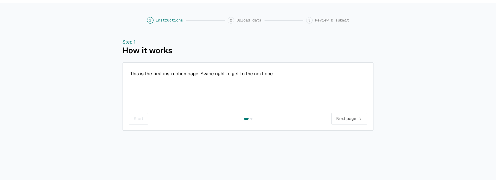
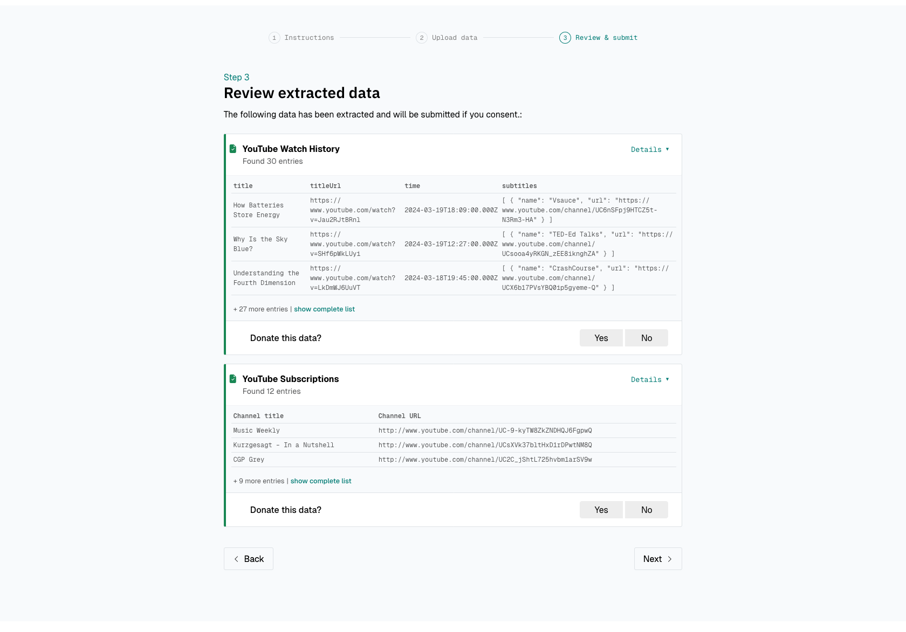

# Data Donation Overview

The data donation page will be displayed to participants after the
[briefing page](../briefing.md).

Before providing more information on the configuration options of the data donation page, it is helpful to get a
first overview from both the participants' and the researchers' perspectives.

## Participants' Perspective

From the **participants' perspective**, this page includes three steps:

1. The donation instructions.
{ width="95%" }

2. An upload form through which participants can upload their data donation.
3. An overview of the extracted data to review the data before giving explicit consent to submit 
them to the research project.
{ width="95%" }

## Researchers' Perspective

From **the researchers' perspective**, the purpose of the data donation page is to:

1. Providing participants with instructions.
2. Providing participants the possibility to upload their donation.
3. Verify that the participant uploads the correct data.
4. Clean and filter the data that participants upload according to pre-defined extraction rules.
5. Provide the participant the possibility to review the cleansed and filtered data before data transmission.
6. Obtain informed consent from participants.

These steps take all place on the participants devices and no personal data leave the participants' devices before they
provide their consent and click on "transmit data".

The next pages will guide you through how you can configure the data donation step.
