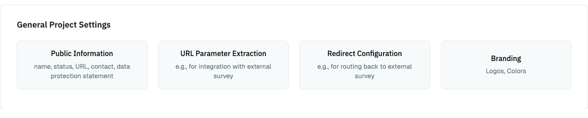

# Data Collection Configuration

This part of the documentation will take you through the steps involved in 
setting up a data collection. This includes the setup of:

1. Briefing Page: Define what is displayed to participants when they enter your project.
2. Data Donation: Define the expected data donations, extraction rules, and donation instructions.
3. Questionnaire: Define questions that will be shown to participants after they have donated their data.
4. Debriefing Page: Define what is displayed when participants reach the end of the data donation.

Currently, the order of these parts is fixed (e.g., you cannot change the order 
of the data donation and the questionnaire to ask questions before the donation, 
and you cannot hide/skip the briefing and debriefing pages). However, the
questionnaire is optional and can be skipped.

You can access the configuration of each of these parts through the
_Data Collection Configuration_ section in the Project Hub:

{ width="90%" }

The following pages will take you step-by-step through the configuration.
