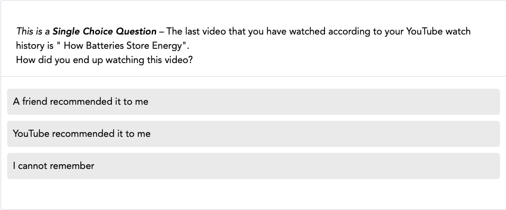
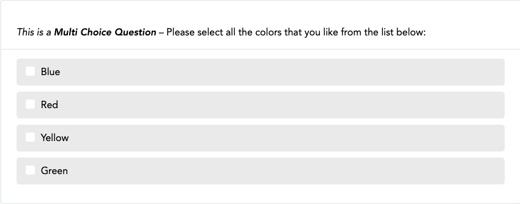
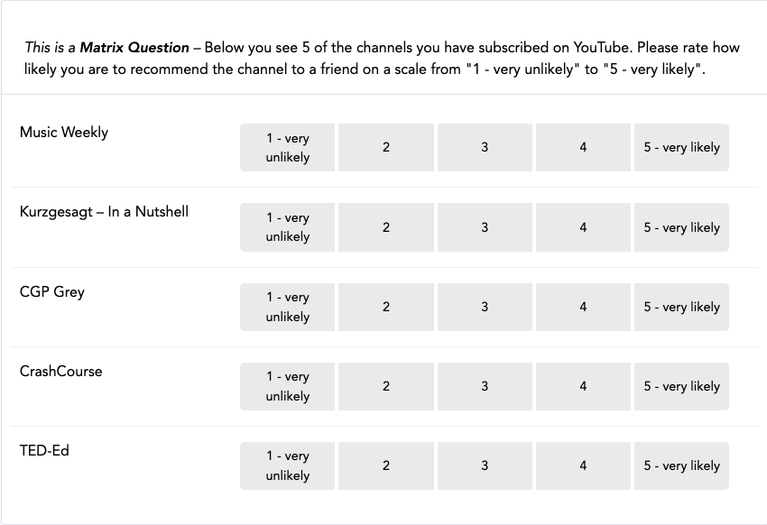
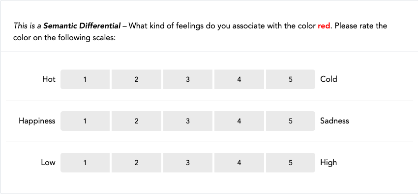
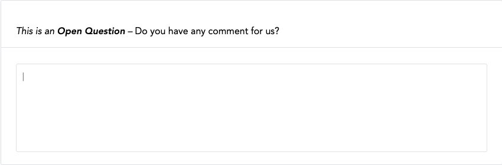
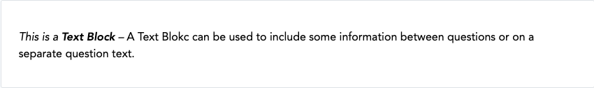

# Questionnaire Configuration

This page explains the settings related to the configuration of the questionnaire and its questions.
As shown before, the following question types are implemented:

* Single Choice Question:

{ width="80%" }

* Multi Choice Question

{ width="80%" }

* Matrix Question

{ width="80%" }

* Semantic Differential

{ width="80%" }

* Open Question

{ width="80%" }

* Text Block (plain text, without any response options for the participant)

{ width="80%" }

Depending on the question type, different configuration options are available.

## General Settings

The following configuration settings are available for all question types:

| Setting             | What it's for                                                            |
|---------------------|--------------------------------------------------------------------------|
| `Name`              | A question name, used for internal organisation only.                    |
| `Blueprint`         | Whether the question is general or related to a Blueprint.               |
| `Page`              | Number of the page on which the question will be displayed.              |
| `Index`             | Order in which questions on the same page will be displayed.             |
| `Variable Name`     | The variable name associated to a question, included in the data export. |
| `Text`              | The question text that is displayed to participants.                     |
| `Requirement level` | Whether and how strictly a participant must answer the question.         |
| `Randomize items`   | Enable or disable randomization of all items.                            |

??? setting-details "Setting Details"

    ---

    #### `Name`

    A question name. This name is only used for internal organisation and is not visible to participants.

    ---

    #### `Blueprint`

    A question can either be _general_ or related to a
    [_Blueprint_](../datadonation/datadonation_configuration.md).
    **General questions** are displayed to all participants, regardless if they successfully
    donated any data.
    **Questions related to a Blueprint** are only displayed to those participants
    that successfully uploaded some data to the related file blueprint.
    This means that if no donated data were extracted by the related Blueprint (either because the
    extraction _failed_, _was not attempted_ or _all entries were filtered out by the extraction rules_),
    the question will not be displayed.
    Consult the section on [integrating donated data in the questionnaire](questionnaire_data_integration.md) for more information.

    ---

    #### `Page`

    Number of the page on which the question will be displayed.

    ---

    #### `Index`

    Order in which questions on the same page will be displayed.

    ---

    #### `Variable Name`

    The variable name associated to a question. This name will be included
    in the data export. For items belonging to a question, the variable name will
    be constructed as follows: "question_variable_name-+{item-value+}".

    ---

    #### `Text`

    The question text that is displayed to participants.

    ---

    #### `Requirement level`

    `Not required`: A participant can skip the question.
    `Soft`: the application will show a
    hint to the participant if they forgot to answer the question.
    This hint will only be shown once. This means that if a participant chooses to
    ignore the hint and clicks on 'continue', they are able to skip a required question.
    `Hard`: the application will show a hint and the participant cannot skip the
    question.

    ---

    #### `Randomize items`

    Enable or disable randomization of **all** items.

## Specific Settings

### Open Question

| Setting                | What it's for                                                                 |
|------------------------|-------------------------------------------------------------------------------|
| `Input type`           | Whether to restrict input to text, number, or a valid email address.          |
| `Maximum input length` | Restricts the input to a certain number of characters.                        |
| `Display`              | Whether to show a small one-line input field or a larger multi-line text-box. |
| `Multi item response`  | Whether to define items each requiring a separate text input.                 |

??? setting-details "Setting Details"

    ---

    #### `Input type`

    Define whether to apply restrictions for the input to
    this field. Can be 'text' to allow any kind of text, 'number' to
    only allow numerical characters, or 'email' to only allow valid
    email addresses. Default is 'text'.

    ---

    #### `Maximum input length`

    Restricts the input to a certain number of characters.
    If this option is left empty, no input length restriction is enforced.

    !!! note
    
        The `input type` and `maximum input length` options are only "softly" enforced
        in the participant's browser by hinting at and highlighting non-compliant input.
        This means that these restrictions are not enforced on the server-side if
        participants choose to ignore the input hint.

    ---

    #### `Display`

    Define whether to show a 'small' one-line input field or
    a larger multi-line text-box. Defaults to "small" and only
    applies when the chosen input type is "Text".

    ---

    #### `Multi item response`

    If this is selected, you can define items for each of which the participants
    will be asked to provide a text input. If not selected, the question will be rendered with just one
    input field below the question text.

### Matrix Question

| Setting               | What it's for                       |
|-----------------------|-------------------------------------|
| `Show scale headings` | Option to show/hide scale headings. |

??? setting-details "Setting Details"

    ---

    #### `Show scale headings`

    Option to show/hide scale headings.

### Question Items

For Single Choice Questions, Multiple Choice Questions, Matrix Questions and Semantic Differentials,
participants answer in relation to question items. To configure question items, the following
settings are available:

| Setting           | What it's for                                                                            |
|-------------------|------------------------------------------------------------------------------------------|
| `Index`           | Defines the order in which the items are displayed.                                      |
| `Label`           | The label/text of the item that is displayed to participants related to an item.         |
| `Label Right`     | Only for semantic differential questions: the label on the right-hand side of the scale. |
| `Value`           | The identifier of an item, used to indicate selected item(s) in the data export.         |
| `Randomize`       | Allows randomizing only certain items while others stay in place.                        |
| `Delete`          | Check this box to delete the item.                                                       |

??? setting-details "Setting Details"

    ---

    #### `Index`

    Defines the order in which the items are displayed.

    ---

    #### `Label`

    The label/text of the item that is displayed to participants related to an item.
    For semantic differential questions, this is the label displayed on the left-hand side of the scale.

    ---

    #### `Label Right`

    Only for semantic differential questions. The label displayed on the
    right-hand side of the scale.

    ---

    #### `Value`

    Is (_a_) the identifier of an item and (_b_) used to indicate which
    item(s) has or have been selected in the data export (only for Single and Multi
    Choice Questions).

    ---

    #### `Randomize`

    Instead of randomizing the order of all items with the _randomize_ setting
    on the question level, this setting allows randomizing only certain items while
    those for which this option is not ticked stay in their place (i.e., according to
    their index).

    ---

    #### `Delete`

    Check this box to delete the item. It will be deleted when you click _Save_.

### Scale Configuration

For Matrix Questions and Semantic Differentials, participants give their answers (or in other words: rate
the question items) with the configured question scale.

| Setting           | What it's for                                                                    |
|-------------------|----------------------------------------------------------------------------------|
| `Index`           | Defines the order in which the items are displayed.                              |
| `Input label`     | The text that is displayed within the scale-points/input-buttons.                |
| `Heading label`   | The text displayed above the scale-points/input-buttons (Matrix Questions only). |
| `Value`           | Used to indicate which scale point has been selected in the data export.         |
| `Secondary point` | Marks a scale point to be rendered differently than the 'regular' scale points.  |
| `Delete`          | Check this box to delete the scale point.                                        |

??? setting-details "Setting Details"

    ---

    #### `Index`

    Defines the order in which the items are displayed.

    ---

    #### `Input label`

    The text that is displayed within the scale-points/input-buttons.

    !!! tip
    
        When you have long labels on Question Items or Scale Points, or you have many scale points, it is a good practice to
        define optional word-breaks in your labels. To do so, you can use the html code `&shy;`, which will break the word
        in this position with a hyphen if there is not enough space to render the complete word. E.g., "un&shy;decided" will
        be rendered as "un- decided" if the whole word does not fit on one line.

    ---

    #### `Heading label`

    The text that is displayed above the scale-points/input-buttons (currently, only possible for
    Matrix Questions).

    ---

    #### `Value`

    Used to indicate which scale point has been selected in the data export.

    ---

    #### `Secondary point`

    If a scale point is marked as 'secondary point' it will be rendered differently than the 'regular' scale points.
    This is useful to, e.g., offer a "Don't know" option to participants that is visually seperated from the main scale.

    ---

    #### `Delete`

    Check this box to delete the scale point. It will be deleted when you click _Save_.

### Filter Configuration

You can conditionally hide questions or items based on answers to previous questions using filter conditions.

| Setting                    | What it's for                                                       |
|----------------------------|---------------------------------------------------------------------|
| `Index`                    | Sets the order in which filter conditions are applied.              |
| `Combinator`               | Defines how multiple filter conditions are combined (`AND` / `OR`). |
| `Comparison Question/Item` | The question or item whose answer is used in the comparison.        |
| `Comparison Operator`      | Specifies how the answer should be compared to the value.           |
| `Comparison Value`         | The value to compare against.                                       |
| `Delete`                   | Check this box to remove the condition.                             |

??? setting-details "Setting Details"

    ---

    #### `Index`

    Sets the order in which filter conditions are applied.

    ---

    #### `Combinator`

    Defines how multiple filter conditions are combined: `AND` = all conditions must be met,
    `OR` = any condition must be met for the filter to be applied (ignored for the first (lowest index) condition, so can
    be set to any value for the first condition).

    **Note:** Conditions are evaluated as a chain, with AND having higher priority than OR. For example:
    `Condition1 OR Condition2 AND Condition3 OR Condition4` will be evaluated as
    `Condition1 OR (Condition2 AND Condition3) OR Condition4`).

    Options: `AND`, `OR`.

    ---

    #### `Comparison Question/Item`

    The question or item whose answer is used in the comparison (the _left side_ of the condition).

    ---

    #### `Comparison Operator`

    Specifies how the answer should be compared to the value.
    Options: `Equal (==)`, `Not Equal (!=)`, `Greater than (>)`, `Smaller than (<)`,
    `Greater than or equal (>=)`, `Smaller than or equal (<=)`, `Contains`, `Does not Contain`.

    ---

    #### `Comparison Value`

    The value to compare against (the _right side_ of the condition).

    ---

    #### `Delete`

    Check this box to remove the condition. It will be deleted when you click _Save_.

!!! note

    **Behavior when all items of a question are filtered out:** When all items of a question are filtered out, the entire
    question will not be displayed. If the filtered question is the only question on a page, the entire page will be skipped
    and the user will proceed to the next available page.
