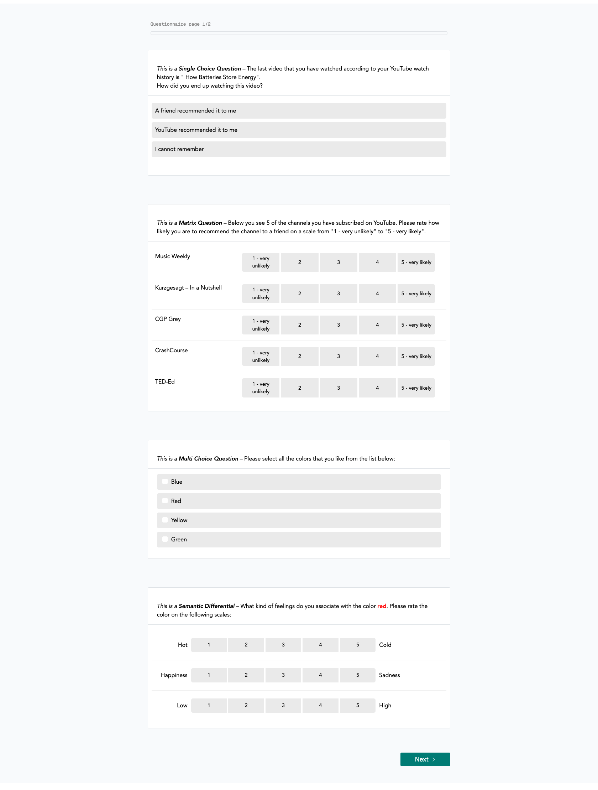

# Questionnaire Overview

Researchers can define a questionnaire that is displayed **after** the data donation step. It consists of one
or more pages, each consisting of one or more questions.

## Participants' Perspective

From the participants' perspective, the questionnaire will look something like this:

{ width="95%" }

## Question Types

The following question types are available in the questionnaire:

* Single Choice Question
* Multi Choice Question
* Matrix Question
* Semantic Differential
* Open Question
* Transition Block (plain text, without any response options for the participant)

You can find more details on the [Questionnaire Configuration](questionnaire_configuration.md) page.

## Integrate Donated Data in Questionnaire

The questionnaire also offers the option to integrate parts of the donated data in the question text
or the question items. For example, if participants donate a watch history, you could
include the last watched element as part of a question to obtain responses in relation to that element
(e.g., "Why have you watched <TITLE OF LAST ELEMENT>"). The part _<TITLE OF LAST ELEMENT>_ will then be
rendered for each participant individually, based on their donated data.

You can [find out more about the possibility to render data dynamically here](questionnaire_data_integration.md).

## Export of Collected Responses

The collected responses can be exported in the [data center](../../data_center/index.md).

### Default values

The responses may include the following default values:

- `-77`: Indicates that a question or item was filtered out.
- `-99`: Indicates that a respondent saw a question or item but did not provide an answer/skipped the question.

## Notes on the Questionnaire Flow

!!! info

    The questionnaire responses are only submitted to the server after all questions have been answered.
    This means that if a participants aborts the questionnaire after filling out, e.g., 2 out of
    4 questions, no responses will be collected and saved on the server.
