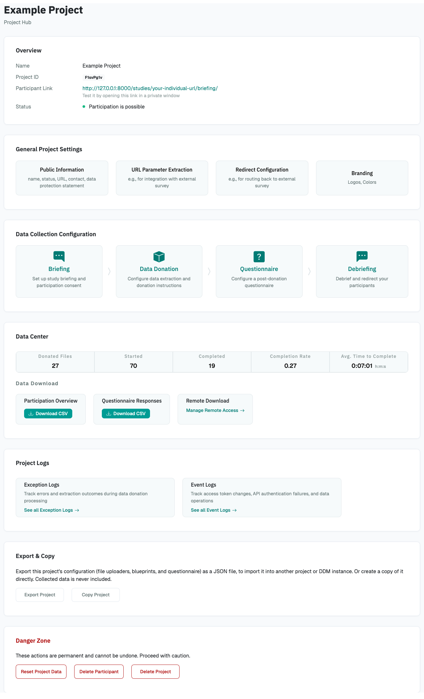
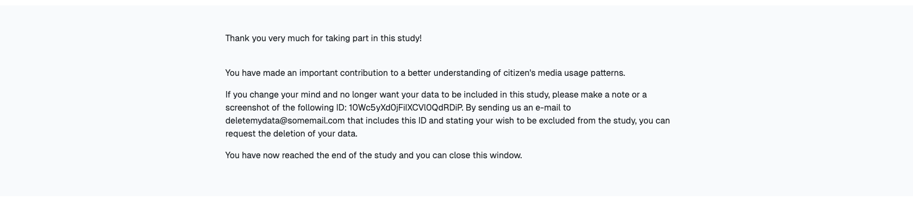

# Documentation for Researchers

This part of the documentation is directed at researchers who want to use DDM 
to set up a data donation collection. It describes DDM's functionality in detail 
and demonstrates how to configure a data donation project.

## Overview

DDM consists of a _Researcher Interface_ and a _Participation Interface_.

### Researcher Interface

Through the Researcher Interface, researchers can create and manage data donation projects.
It essentially provides a website to adjust the settings of the project in general
as well as the settings affecting the Participation Interface. To give a first 
impression of how the Researcher Interface looks, you see below a screenshot of 
the Project Hub, the main page through which you can configure a project:

{ width="75%" }

### Participation Interface

Your participants will take part in your data donation collection through 
the *Participation Interface*. The Participation Interface usually consists of
the following steps:

1. A briefing page
{ width="95%" }

2. the data donation page (instructions > file upload > review and consent)
{ width="95%" }

3. a questionnaire (optional)
{ width="95%" }

4. a debriefing page.
{ width="95%" }

The following section will take you through creating and monitoring a 
data donation project as well as accessing the collected data.
